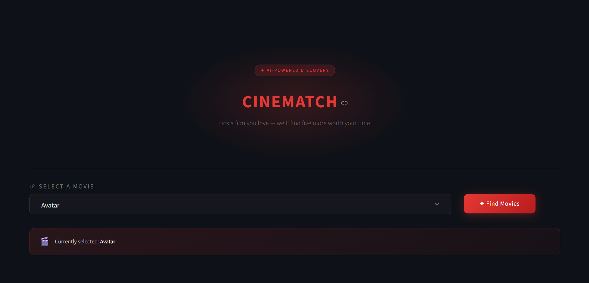
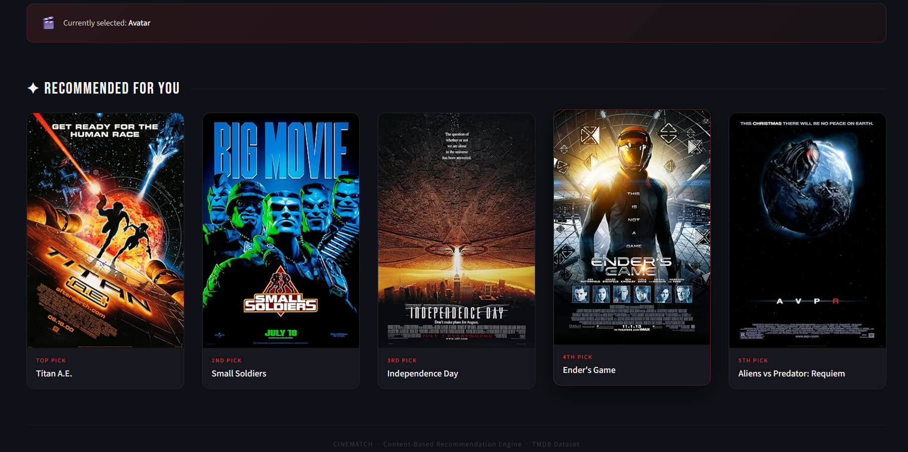

# 🎬 CineMatch — Content-Based Movie Recommendation System

A content-based movie recommendation engine built on the **TMDB 5000 Movies Dataset**, served through a custom-themed **Streamlit** web app. Pick any movie you love, and CineMatch instantly surfaces five similar titles — complete with posters fetched live from the OMDb API.

<p align="center">
  
</p>

<p align="center">
  
</p>

---

## 📌 Overview

CineMatch uses **content-based filtering** to recommend movies similar to a user's selection. Instead of relying on user ratings or behavior (collaborative filtering), it analyzes each movie's *content* — overview, genres, keywords, cast, and director — to measure similarity between films and recommend the closest matches.

---

## ✨ Features

- 🔍 **Searchable dropdown** of ~4,800+ movies from the TMDB dataset
- 🤖 **Content-based recommendation engine** using cosine similarity on engineered text features
- 🎞️ **Live poster fetching** via the OMDb API, with graceful fallback for missing posters
- 🎨 **Custom dark-themed UI** built entirely with Streamlit + injected CSS (no default Streamlit styling)
- ⚡ **Pre-computed similarity matrix** (pickled) for instant recommendations with no retraining at runtime

---

## 🧠 How It Works

### 1. Data Preparation
The [`tmdb_5000_movies.csv`](tmdb_5000_movies.csv) and [`tmdb_5000_credits.csv`](tmdb_5000_credits.csv) datasets are merged on `title`, and relevant columns are retained:

```
movie_id, title, overview, genres, keywords, cast, crew
```

### 2. Feature Engineering
Raw JSON-like columns (`genres`, `keywords`, `cast`, `crew`) are parsed using `ast.literal_eval()` and transformed into clean keyword lists:

| Column | Transformation |
|---|---|
| `genres` | Extract genre names |
| `keywords` | Extract keyword tags |
| `cast` | Top 3 billed actors |
| `crew` | Director's name only |

Multi-word names are collapsed (e.g., `Science Fiction` → `ScienceFiction`) so they're treated as single tokens during vectorization.

### 3. Tag Construction
All engineered features are concatenated into a single `tags` column — a bag-of-words representation of each movie — then lowercased into one string per film.

### 4. Vectorization & Similarity
- **`CountVectorizer`** (scikit-learn) converts the `tags` text into 5,000-dimensional vectors, with English stop words removed.
- **Cosine similarity** is computed across all movie vectors, producing a similarity matrix where each cell represents how alike two movies are.

### 5. Recommendation
For a selected movie, the engine looks up its similarity row, sorts all other movies by similarity score, and returns the **top 5 closest matches**.

### 6. Serialization
The processed data and similarity matrix are pickled (`movie_dict.pkl`, `similarity.pkl`) so the Streamlit app loads instantly without re-running the ML pipeline on every launch.

---

## 🗂️ Project Structure

```
Movie Recommendation/
│
├── Screenshots/
│   ├── Dashboard.png
│   └── Recommendations.png
│
├── tmdb_5000_movies.csv          # Raw movie metadata
├── tmdb_5000_credits.csv         # Raw cast & crew data
│
├── movie_recommendation_train.py # Data preprocessing + model training script
├── movie_recommender_streamlit.py# Streamlit web application
│
├── movie_dict.pkl                # Processed movie data (pickled)
├── similarity.pkl                # Precomputed cosine similarity matrix
│
├── requirements.txt
└── README.md
```

---

## 🛠️ Tech Stack

| Layer | Tools |
|---|---|
| Language | Python |
| Data Processing | Pandas, ast |
| Machine Learning | scikit-learn (`CountVectorizer`, `cosine_similarity`) |
| Web App | Streamlit |
| External API | OMDb API (movie posters) |
| Serialization | Pickle |

---

## 🚀 Getting Started

### Prerequisites
- Python 3.8+
- pip

### 1. Clone the repository
```bash
git clone https://github.com/Gayathri-Reddy874/cinematch-movie-recommender.git
cd cinematch-movie-recommender
```

### 2. Install dependencies
```bash
pip install -r requirements.txt
```

### 3. (Optional) Re-train the model
The pickled files are already included, so this step is optional unless you want to regenerate them from the raw CSVs:
```bash
python movie_recommendation_train.py
```
This produces `movie_dict.pkl` and `similarity.pkl`.

### 4. Run the Streamlit app
```bash
streamlit run movie_recommender_streamlit.py
```
The app will open automatically in your browser at `http://localhost:8501`.

---

## 🎮 Usage

1. Select any movie from the searchable dropdown.
2. Click **✦ Find Movies**.
3. View 5 recommended titles, each with a fetched poster and rank label (Top Pick → 5th Pick).

---

## 📊 Dataset

This project uses the publicly available **[TMDB 5000 Movie Dataset](https://www.kaggle.com/datasets/tmdb/tmdb-movie-metadata)**, consisting of:
- `tmdb_5000_movies.csv` — budget, genres, overview, keywords, popularity, revenue, runtime, vote data, etc.
- `tmdb_5000_credits.csv` — cast and crew information per movie

---

## 🔮 Future Improvements

- [ ] Add TMDB API integration as a primary poster source with OMDb as fallback
- [ ] Incorporate weighted ratings (`vote_average`, `vote_count`) to break ties between equally similar movies
- [ ] Experiment with TF-IDF and word embeddings (e.g., word2vec) as alternatives to `CountVectorizer`
- [ ] Add a hybrid filtering layer combining content-based and collaborative signals
- [ ] Deploy publicly via Streamlit Community Cloud

---

## 👩‍💻 Author

**Mallareddygari Gayathri**
Data Analyst | AI/ML Engineering Graduate
📍 Bangalore, India
🔗 [GitHub](https://github.com/Gayathri-Reddy874)

---

## 📄 License

This project is open-source and available for educational and portfolio purposes. The dataset is sourced from TMDB via Kaggle and is subject to its respective usage terms.
